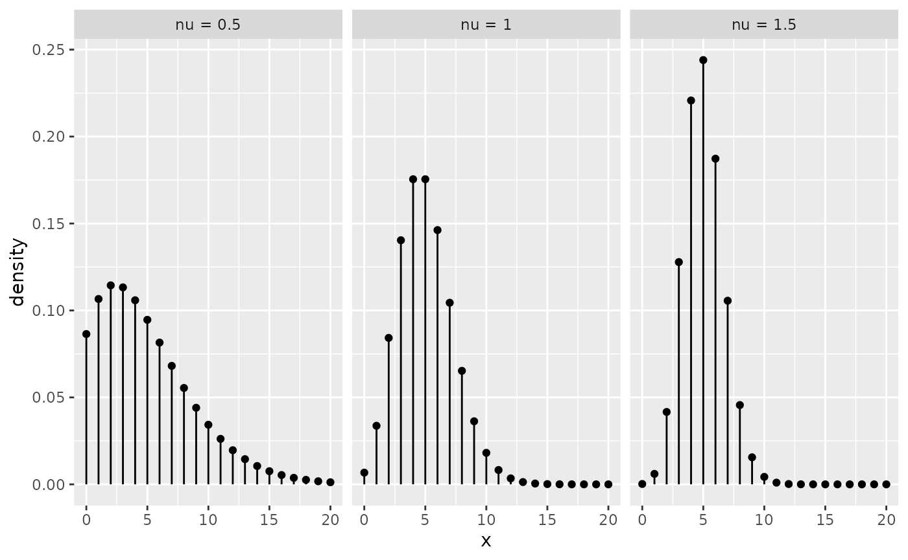
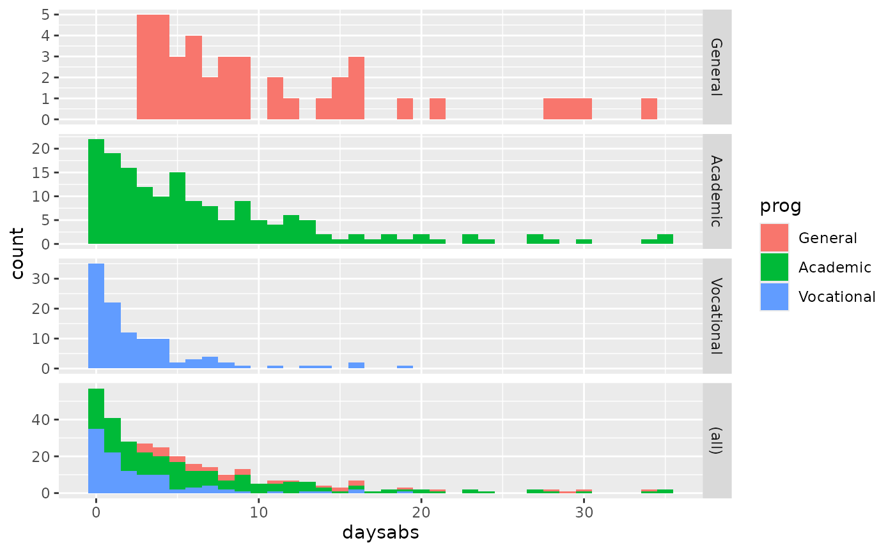
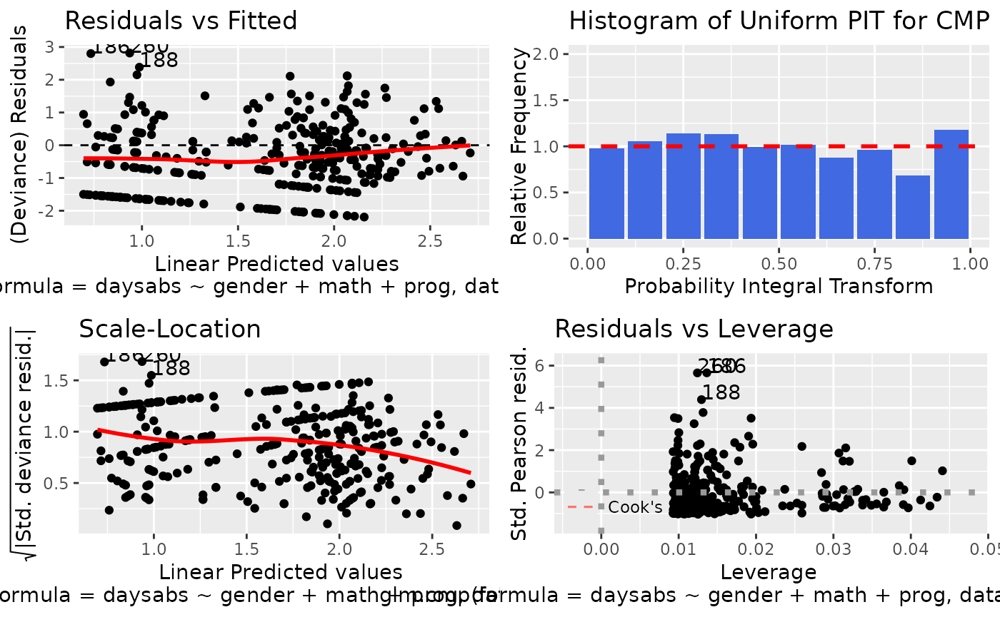
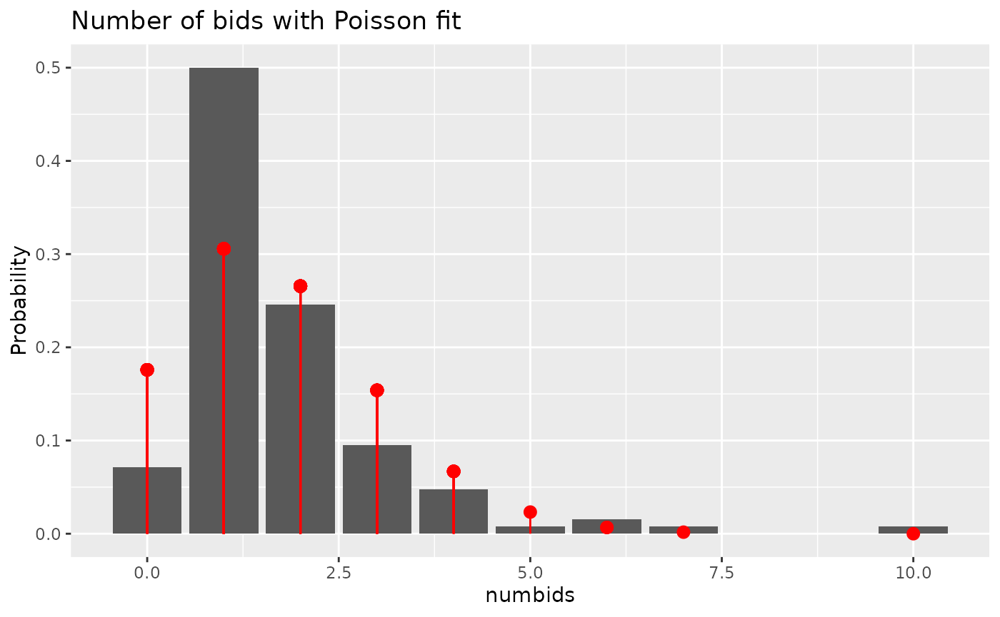

# Getting Started with the \`mpcmp\` package

## Introduction

Conway–Maxwell–Poisson (CMP or COM-Poisson) distributions have seen a
recent resurgence in popularity for the analysis of dispersed counts
(e.g., Shmueli et al. (2005); Lord et al. (2008); Lord et al. (2010);
Sellers and Shmueli (2010); Sellers and Premeaux (2020)). Key features
of CMP distributions include the ability to handle both over- and
under-dispersion while containing the classical Poisson distribution as
a special case. See the corresponding
[Wikipedia](https://en.wikipedia.org/wiki/Conway%E2%80%93Maxwell%E2%80%93Poisson_distribution)
page for a quick summary or Shmueli et al. (2005) for a more detailed
overview of the history, features and applications of CMP distributions.

The R (R Core Team (2020)) `mpcmp` package of Fung et al. (2020)
provides the functionality for estimating a mean-parametrized
Conway-Maxwell-Poisson generalized linear models for dispersed count
data. The package is available from the Comprehensive R Archive Network
(CRAN) [here](http://CRAN.R-project.org/package=mpcmp). Huang (2017)
provides the theoretical development of the model that this package
bases on.

## Conway-Maxwell-Poisson Distributions

The CMP distribution was first used by Conway and Maxwell (1962) as a
model for a queuing system with dependent service times. A random
variable is said to have a (standard) CMP distribution with rate
parameter $`\lambda`$ and dispersion parameter $`\nu`$ if its
probability mass function (pmf) is given by
``` math
P(Y =y|\lambda,\nu)= \frac{\lambda^y}{(y!)^{\nu}}\frac{1}{Z(\lambda,\nu)}, \quad y =0,1,2,...,
```
where
``` math
Z(\lambda,\nu)= \sum^{\infty}_{y=0}\frac{\lambda^y}{(y!)^{\nu}},
```
is a normalizing constant. The CMP includes Poisson ($`\nu = 1`$),
geometric ($`\nu = 0`$, $`\lambda < 1`$) and Bernoulli
($`\nu \to \infty`$ with probability $`\lambda/(1+\lambda)`$) as its
special cases.

One of the major limitations of CMP distributions is that it is not
directly parametrized via the mean as it does not have closed-form
expression for its moments in terms of the parameters $`\lambda`$ and
$`\nu`$. For the first two moments, approximations can be obtained as
``` math
\begin{aligned}
E(Y)  &\approx \lambda^{\frac{1}{\nu}}-\frac{\nu-1}{2\nu}\quad  \text{and} \quad Var(Y) \approx \frac{1}{\nu}E(Y),
\end{aligned}
```
and they can be particularly accurate for $`\nu\leq 1`$ or
$`\lambda>10^{\nu}`$ (see Shmueli et al. (2005)). If $`\nu < 1`$, CMP is
overdispersed. In reverse, CMP is underdispersed when $`\nu>1`$. Here is
a plot of the density for a few CMP distributions with mean $`\mu = 5`$:



## Conway-Maxwell-Poisson Generalized Linear Models

As CMP is one of a few distributions that can handle both under- and
over-dispersion, the aim is to extend the GLM formulation to the CMP
case so that one can model the relationship between $`Y`$ and the
predictors $`X`$. Given a set of covariates $`X \in R^q`$, Sellers and
Shmueli (2010) proposed a GLM for count response $`Y`$ that can be
specified via
``` math
Y|X ∼ CMP(\lambda,\nu), \quad \text{s.t.} \quad \log\lambda = X^{\top}\beta
```
where $`\beta \in R^q`$ is a vector of regression coefficients. This
model, however, does not provide a closed-form relationship between
$`E(Y)`$ and the linear predictor, making it incompatible with other
commonly used log-linear models.

As it is more convenient and interpretable to model the mean
$`\mu = E(Y)>0`$ of the distribution directly, Huang (2017) proposed to
parametrize the CMP distribution via the mean:
``` math
P(Y = y|\mu, \nu) = \frac{\lambda(\mu,\nu)^{y}}{(y!)^{\nu}}\frac{1}{Z(\lambda(\mu,\nu),\nu)}, \quad y = 0,1,2,\ldots,
```
where the rate $`\lambda(\mu,\nu)`$ is defined as the solution to the
mean constraint:
``` math
 \mu= \sum^{\infty}_{y=0} y\frac{\lambda^y}{(y!)^{\nu}}\frac{1}{Z(\lambda,\nu)}.
```
We shall denote this as CMP$`_{\mu}(\mu, \nu)`$ distribution to
distinguish it from the original/standard one.

A GLM that based on CMP$`_{\mu}`$ can then be specified via
``` math
Y|X ∼ CMP_{\mu}(\mu(X^{\top}\beta),\nu), 
```
where
``` math
E(Y|X) = \mu(X^{\top}\beta) = \exp(X^{\top}\beta).
```
Note that GLM that based on CMP$`_{\mu}`$ is a genuine GLM, so all the
familiar key features of GLMs (e.g., McCullagh and Nelder (1989),
Chapter 2) are retained.

The mean-dispersion specification makes CMP$`_{\mu}`$ directly
comparable and compatible other commonly used log-linear regression
models for counts. In particular, the mean $`\mu = \exp(X^{\top}\beta)`$
is functionally independent of the dispersion parameter $`\nu`$, making
it similar in structure to the familiar Negative Binomial regression
model for overdispersed counts.

The model can also be extended to allow varying dispersion, i.e. $`\nu`$
itself is modelled via a regression:
``` math
\nu = \exp(\tilde{X}^{\top}\gamma),
```
where $`\tilde{X}`$ is some covariates.

## The `mpcmp` package

The main modelling function in our `mpcmp` package is
[`glm.cmp()`](https://thomas-fung.github.io/mpcmp/reference/glm.cmp.md).
The optimisation is done using Fisher Scoring updates to take advantage
of the fact the CMP$`_{\mu}`$ belongs to the exponential family. Notice
that this is a constrained optimisation problem as we have to maintain
mean constraints at all times, which makes the implementation is a bit
more challenging.

The package implements similar methods to those related to `glm`
objects. If you used [`glm()`](https://rdrr.io/r/stats/glm.html)
previously, you should feel right at home. Once a fitted model object
has been obtained, there are assessor functions available to extract the
coefficients ([`coef()`](https://rdrr.io/r/stats/coef.html), or its
alias [`coefficients()`](https://rdrr.io/r/stats/coef.html)), the fitted
values ([`fitted()`](https://rdrr.io/r/stats/fitted.values.html) or its
alias [`fitted.values()`](https://rdrr.io/r/stats/fitted.values.html)),
the residuals ([`residuals()`](https://rdrr.io/r/stats/residuals.html)
or its alias [`resid()`](https://rdrr.io/r/stats/residuals.html)), the
model frame
([`model.frame()`](https://rdrr.io/r/stats/model.frame.html)), the
number of observations (nobs()), the log-likelihood
([`logLik()`](https://rdrr.io/r/stats/logLik.html)), and the AIC
([`AIC()`](https://rdrr.io/r/stats/AIC.html)).

You can also use
[`plot()`](https://rdrr.io/r/graphics/plot.default.html) or
[`autoplot()`](https://ggplot2.tidyverse.org/reference/autoplot.html) to
obtain diagnostic plots of the fitted model.

Let’s go through some examples to show you what our package can do!

## Constant Overdispersion Example: `attendance`

The `attendance` dataset (originally from
<https://stats.idre.ucla.edu/r/dae/negative-binomial-regression/>)
examines the relationship between the number of days absent from school
and the gender, maths score and academic program of 314 students from
two urban high schools.

``` r

library(mpcmp)
data(attendance)
library(ggplot2)
ggplot(attendance, aes(daysabs, fill = prog)) +
  geom_histogram(binwidth = 1) +
  facet_grid(prog ~ ., margins = TRUE, scales = "free")
```



It appears students enrolled into the General program tend to miss more
days of school than those enrolled into the Academic or the Vocational
program. There is some overdispersion in this dataset. We can use
[`glm.cmp()`](https://thomas-fung.github.io/mpcmp/reference/glm.cmp.md)
to fit the mean-parametrized CMP model to try to account for that
overdispersion.

``` r

M.attendance <- glm.cmp(daysabs ~ gender + math + prog, data = attendance)
summary(M.attendance)
#> 
#> Call: glm.cmp(formula = daysabs ~ gender + math + prog, data = attendance)
#> 
#> Deviance Residuals: 
#>     Min       1Q   Median       3Q      Max  
#> -2.1925  -1.1166  -0.3973   0.2964   2.8154  
#> 
#> Linear Model Coefficients:
#>                 Estimate   Std.Err Z value Pr(>|z|)    
#> (Intercept)     2.714645  0.190407  14.257  < 2e-16 ***
#> gendermale     -0.214720  0.117148  -1.833  0.06682 .  
#> math           -0.006323  0.002386  -2.650  0.00804 ** 
#> progAcademic   -0.425322  0.169525  -2.509  0.01211 *  
#> progVocational -1.253896  0.189478  -6.618 3.65e-11 ***
#> ---
#> Signif. codes:  0 '***' 0.001 '**' 0.01 '*' 0.05 '.' 0.1 ' ' 1
#> 
#> (Dispersion parameter for Mean-CMP estimated to be 0.02024)
#> 
#> 
#>     Null deviance: 455.83  on 313 degrees of freedom
#> Residual deviance: 377.44  on 309 degrees of freedom
#> 
#> AIC: 1739.026
```

As `mpcmp` is directly comparable and compatible with other commonly
used log-linear regression models for counts, interpreting parameters is
straight forward. Our model estimates that students in the General
program (the reference level) are expected to miss exp(+1.254) = 3.5
times more days of school compared to students in the Vocational
program.

To see whether a simpler Poisson model, i.e. $`\nu = 1`$ is adequate, we
can run the model through the
[`LRTnu()`](https://thomas-fung.github.io/mpcmp/reference/LRTnu.md)
function:

``` r

LRTnu(M.attendance)
#> 
#>  Likelihood ratio test for testing nu = 1
#> 
#> data:  M.attendance
#> LR statistic = 903, df = 1, p-value < 2.2e-16
#> sample estimates:
#> log-lik for Mean-CMP  log-lik for Poisson 
#>                 -864                -1320
```

As the P-value is small, we conclude that dispersion is present in this
data set.

One of the key features of the `mpcmp` package is that it provides a
range of diagnostic plots.

``` r

autoplot(M.attendance)
```



Please refer to
[`?autoplot`](https://ggplot2.tidyverse.org/reference/autoplot.html) to
see what diagnostic plots are available for a `cmp` class object.

The `mpcmp` package also supports `broom` `tidier` method.

``` r

tidy(M.attendance)
#> # A tibble: 5 × 5
#>   term           estimate std.error statistic  p.value
#>   <chr>             <dbl>     <dbl>     <dbl>    <dbl>
#> 1 (Intercept)     2.71      0.190       14.3  4.05e-46
#> 2 gendermale     -0.215     0.117       -1.83 6.68e- 2
#> 3 math           -0.00632   0.00239     -2.65 8.04e- 3
#> 4 progAcademic   -0.425     0.170       -2.51 1.21e- 2
#> 5 progVocational -1.25      0.189       -6.62 3.65e-11
```

This means “cmp” objects can take advantage of any packages that
required `broom` support such as the `modelsummary` package:

``` r

M_poisson <- glm(daysabs ~ gender + math + prog, data = attendance, family = poisson)
M_nb <- MASS::glm.nb(daysabs ~ gender + math + prog, data = attendance)
modelsummary::modelsummary(list(
  mpcmp = M.attendance,
  Poisson = M_poisson,
  Neg.Bin = M_nb
))
```

|                | mpcmp    | Poisson   | Neg.Bin  |
|----------------|----------|-----------|----------|
| (Intercept)    | 2.715    | 2.759     | 2.707    |
|                | (0.190)  | (0.064)   | (0.204)  |
| gendermale     | -0.215   | -0.242    | -0.211   |
|                | (0.117)  | (0.047)   | (0.122)  |
| math           | -0.006   | -0.007    | -0.006   |
|                | (0.002)  | (0.001)   | (0.002)  |
| progAcademic   | -0.425   | -0.426    | -0.425   |
|                | (0.170)  | (0.057)   | (0.182)  |
| progVocational | -1.254   | -1.271    | -1.253   |
|                | (0.189)  | (0.078)   | (0.200)  |
| Num.Obs.       | 314      | 314       | 314      |
| AIC            | 1739.0   | 2640.2    | 1740.3   |
| BIC            | 1761.5   | 2658.9    | 1762.8   |
| Log.Lik.       | -863.513 | -1315.089 | -864.154 |
| F              |          | 104.321   | 17.860   |
| RMSE           |          | 6.34      | 6.34     |

We also implemented a bunch of commonly used methods for “cmp” objects:

``` r

methods(class = "cmp")
#>  [1] AIC            augment        autoplot       coef           confint       
#>  [6] cooks.distance fitted         glance         hatvalues      influence     
#> [11] logLik         model.frame    model.matrix   nobs           plot          
#> [16] predict        print          residuals      rstandard      summary       
#> [21] tidy           update         vcov          
#> see '?methods' for accessing help and source code
```

## Constant Underdispersion Example: `takeoverbids`

One of the key strength of the CMP distribution is that it can handle
underdispersion. Here is an example demonstrating that. A dataset from
Cameron and Johansson (1997) that gives the number of bids received by
126 US firms that were successful targets of tender offers during the
period 1978-85. The dataset comes with a set of explanatory variables
such as defensive actions taken by management of target firm,
firm-specific characteristics and intervention by federal regulators.

If we fit a Poisson distribution to the marginal distribution of the
number of bids, we have:

``` r

data("takeoverbids")
ggplot(takeoverbids) +
  geom_bar(aes(x = numbids, y = ..count.. / sum(..count..))) +
  geom_pointrange(
    aes(
      x = numbids,
      y = dpois(numbids, mean(numbids)),
      ymin = 0,
      ymax = dpois(numbids, mean(numbids))
    ),
    colour = "red"
  ) +
  labs(title = "Number of bids with Poisson fit", y = "Probability")
#> Warning: The dot-dot notation (`..count..`) was deprecated in ggplot2 3.4.0.
#> ℹ Please use `after_stat(count)` instead.
#> This warning is displayed once per session.
#> Call `lifecycle::last_lifecycle_warnings()` to see where this warning was
#> generated.
```

 We can see that the
response variable is more concentrated than a Poisson fit, which is a
sign of underdispersion.

Here, we can use
[`glm.cmp()`](https://thomas-fung.github.io/mpcmp/reference/glm.cmp.md)
to fit the mean-parametrized CMP model to try to account for that
underdispersion.

``` r

M.bids <- glm.cmp(numbids ~ leglrest + rearest + finrest + whtknght
  + bidprem + insthold + size + sizesq + regulatn, data = takeoverbids)
tidy(M.bids)
#> # A tibble: 10 × 5
#>    term        estimate std.error statistic  p.value
#>    <chr>          <dbl>     <dbl>     <dbl>    <dbl>
#>  1 (Intercept)  0.990     0.435       2.27  0.0230  
#>  2 leglrest     0.268     0.123       2.18  0.0292  
#>  3 rearest     -0.173     0.155      -1.12  0.263   
#>  4 finrest      0.0677    0.174       0.388 0.698   
#>  5 whtknght     0.481     0.132       3.65  0.000258
#>  6 bidprem     -0.685     0.308      -2.23  0.0260  
#>  7 insthold    -0.368     0.347      -1.06  0.289   
#>  8 size         0.179     0.0476      3.77  0.000166
#>  9 sizesq      -0.00758   0.00248    -3.05  0.00228 
#> 10 regulatn    -0.0376    0.130      -0.288 0.773
LRTnu(M.bids)
#> 
#>  Likelihood ratio test for testing nu = 1
#> 
#> data:  M.bids
#> LR statistic = 9.72, df = 1, p-value = 0.001821
#> sample estimates:
#> log-lik for Mean-CMP  log-lik for Poisson 
#>                 -180                 -185
```

From the likelihood ratio test, we can see that the dispersion parameter
is significantly different to 1, suggesting the model is trying to
account for that underdispersion.

We can also compare the results with a Poisson model.

``` r

M.bids.pois <- glm(
  numbids ~ leglrest + rearest + finrest + whtknght
    + bidprem + insthold + size + sizesq + regulatn,
  data = takeoverbids,
  family = poisson
)
modelsummary::modelsummary(list(mpcmp = M.bids, Poisson = M.bids.pois),
  statistic_vertical = FALSE, stars = TRUE
)
#> Warning: The `statistic_vertical` argument is deprecated and will be ignored.
#> To display uncertainty estimates next to your coefficients, use a `glue` string
#> in the `estimate` argument. See `?modelsummary`
```

|  | mpcmp | Poisson |
|----|----|----|
| (Intercept) | 0.990\* | 0.986+ |
|  | (0.435) | (0.534) |
| leglrest | 0.268\* | 0.260+ |
|  | (0.123) | (0.151) |
| rearest | -0.173 | -0.196 |
|  | (0.155) | (0.193) |
| finrest | 0.068 | 0.074 |
|  | (0.174) | (0.217) |
| whtknght | 0.481\*\*\* | 0.481\*\* |
|  | (0.132) | (0.159) |
| bidprem | -0.685\* | -0.678+ |
|  | (0.308) | (0.377) |
| insthold | -0.368 | -0.362 |
|  | (0.347) | (0.424) |
| size | 0.179\*\*\* | 0.179\*\* |
|  | (0.048) | (0.060) |
| sizesq | -0.008\*\* | -0.008\* |
|  | (0.002) | (0.003) |
| regulatn | -0.038 | -0.029 |
|  | (0.130) | (0.161) |
| Num.Obs. | 126 | 126 |
| AIC | 382.2 | 389.9 |
| BIC | 413.4 | 418.3 |
| Log.Lik. | -180.088 | -184.948 |
| F |  | 3.755 |
| RMSE |  | 1.22 |
| \+ p \< 0.1, \* p \< 0.05, \*\* p \< 0.01, \*\*\* p \< 0.001 |  |  |

If we compare the two models, we can see that the CMP$`_{\mu}`$ model
fitted the data better. We can also see that all the estimated standard
errors under CMP$`_{\mu}`$ model are smaller which in turn makes the
p-values for both `leglrest` and `bidprem` to drop below 0.05 instead of
0.1 under the Poisson model.

## Varying Dispersion Example: `sitophilus`

Ribeiro et al. (2013) carried out an experiment to assess the
bioactivity of extracts from different parts (seeds, leaves and
branches) of Annona mucosa (Annonaceae) to control Sitophilus zeamaus
(Coleoptera: Curculionidae), a major pest of stored maize/corn in
Brazil. This dataset can be found as part of the `cmpreg` package of
Elias Ribeiro Junior (2020).

In this experiment:

- 10g of corn and 20 animals adults were placed in each Petri dish.
- Extracts prepared with different parts of mucosa or just water
  (control) were completely randomised with 10 replicates.
- The numbers of emerged insects (progeny) after 60 days were recorded
  and some descriptive statistics can be found below.

``` r

library(tidyverse)
data(sitophilus)
sitophilus %>%
  group_by(extract) %>%
  summarise(
    mu = mean(ninsect),
    sigma2 = var(ninsect)
  )
#> # A tibble: 4 × 3
#>   extract    mu sigma2
#>   <fct>   <dbl>  <dbl>
#> 1 Control  31.5  62.5 
#> 2 Leaf     31.3  94.0 
#> 3 Branch   29.9  88.8 
#> 4 Seed      1.1   1.66
```

It appears that the treatment may have some impact on both the mean and
the variance of the number of progeny. Recall that non-constant variance
is the norm in a GLM, non-constant variances do not necessarily mean
varying dispersions. Nonetheless, we will try to use the treatment to
explain the dispersion in the data set. To do that we specify the
`formula_nu` argument in the
[`glm.cmp()`](https://thomas-fung.github.io/mpcmp/reference/glm.cmp.md)
function.

``` r

data(sitophilus)
M.sit <- glm.cmp(formula = ninsect ~ extract, formula_nu = ~extract, data = sitophilus)
summary(M.sit)
#> 
#> Call: glm.cmp(formula = ninsect ~ extract, formula_nu = ~extract, data = sitophilus)
#> 
#> Deviance Residuals: 
#>      Min        1Q    Median        3Q       Max  
#> -2.21084  -1.16849   0.07494   0.64152   1.72653  
#> 
#> Mean Model Coefficients:
#>                Estimate   Std.Err Z value Pr(>|z|)    
#> (Intercept)    3.449988  0.077974  44.245   <2e-16 ***
#> extractLeaf   -0.006369  0.122139  -0.052    0.958    
#> extractBranch -0.052129  0.123387  -0.422    0.673    
#> extractSeed   -3.354677  0.362108  -9.264   <2e-16 ***
#> ---
#> Signif. codes:  0 '***' 0.001 '**' 0.01 '*' 0.05 '.' 0.1 ' ' 1
#> 
#> Dispersion Model Coefficients:
#>               Estimate Std.Err Z value Pr(>|z|)
#> (Intercept)    -0.6652  0.4573  -1.455    0.146
#> extractLeaf    -0.3831  0.6509  -0.589    0.556
#> extractBranch  -0.3724  0.6514  -0.572    0.568
#> extractSeed    -0.1176  1.5461  -0.076    0.939
#> 
#>     Null deviance: 257.211  on 39 degrees of freedom
#> Residual deviance:  41.679  on 32 degrees of freedom
#> 
#> AIC: 260.8279
```

From the model summary, we can see that there is not much evidence to
suggest the dispersions are varying across treatment groups. We can also
formally test whether a constant dispersion model is sufficient here
using a likelihood ratio test as the two models are nested:

``` r

M.sit2 <- update(M.sit, formula_nu = NULL)
cmplrtest(M.sit, M.sit2)
#> 
#>  Likelihood ratio test for testing both COM-Poisson models are
#>  equivalent
#> 
#> data:  M.sit vs. M.sit2
#> LR statistic = 0.439, df = 3, p-value = 0.9321
```

As a result, our final model is

``` r

summary(M.sit2)
#> 
#> Call: glm.cmp(formula = ninsect ~ extract, data = sitophilus)
#> 
#> Deviance Residuals: 
#>     Min       1Q   Median       3Q      Max  
#> -1.9515  -1.2310   0.0794   0.6255   1.6762  
#> 
#> Linear Model Coefficients:
#>                Estimate   Std.Err Z value Pr(>|z|)    
#> (Intercept)    3.449988  0.088455  39.003   <2e-16 ***
#> extractLeaf   -0.006369  0.125289  -0.051    0.959    
#> extractBranch -0.052129  0.126712  -0.411    0.681    
#> extractSeed   -3.354677  0.372197  -9.013   <2e-16 ***
#> ---
#> Signif. codes:  0 '***' 0.001 '**' 0.01 '*' 0.05 '.' 0.1 ' ' 1
#> 
#> (Dispersion parameter for Mean-CMP estimated to be 0.3957)
#> 
#> 
#>     Null deviance: 234.470  on 39 degrees of freedom
#> Residual deviance:  41.408  on 36 degrees of freedom
#> 
#> AIC: 253.2668
```

## Other packages for fitting Conway-Maxwell Poisson Model

There are other `R` packages to deal with CMP models, and they all
contribute to the writing and construction of this package.

- `compoisson`: Routines for density and moments of the CMP distribution
  under original parametrization by Dunn (2012)
- `CompGLM`: Fit CMP models under original parametrization (includes
  dispersion modelling) by Pollock (2018).
- `COMPoissonReg`: Fit CMP models under original parametrization
  (includes zero-inflation and dispersion modelling) by Andrew Raim
  \<andrew.raim@gmail.com\> (2019).
- `cmpreg`: Fit Mean-type parametrized CMP models (includes dispersion
  modelling) by Elias Ribeiro Junior (2020). The authors purposed to
  regress on the approximated mean.
- `DGLMExtPois`: Fit mean-parametrized CMP model (includes dispersion
  modelling) using `nloptr` by Saez-Castillo et al. (2020).
- `glmmTMB`: Fit (among other) CMP models under a different
  mean-parametrization (includes zero-inflation, dispersion modelling
  and random effects) by Brooks et al. (2017).

## References

Andrew Raim \<andrew.raim@gmail.com\>, Kimberly Sellers Thomas Lotze
\<thomas.lotze@thomaslotze.com\>. 2019. *COMPoissonReg: Conway-Maxwell
Poisson (COM-Poisson) Regression*.
<https://CRAN.R-project.org/package=COMPoissonReg>.

Brooks, Mollie E., Kasper Kristensen, Koen J. van Benthem, et al. 2017.
“glmmTMB Balances Speed and Flexibility Among Packages for Zero-Inflated
Generalized Linear Mixed Modeling.” *The R Journal* 9 (2): 378–400.
<https://journal.r-project.org/archive/2017/RJ-2017-066/index.html>.

Cameron, A. Colin, and Per Johansson. 1997. “Count data regression using
series expansions: With applications.” *Journal of Applied Econometrics*
12 (3): 203–23.
<https://doi.org/10.1002/(SICI)1099-1255(199705)12:3%3C203::AID-JAE446%3E3.0.CO;2-2>.

Conway, R. W., and W. L. Maxwell. 1962. *A queuing model with state
dependent service rates*. No. 2. Vol. 12. New York :

Dunn, Jeffrey. 2012. *Compoisson: Conway-Maxwell-Poisson Distribution*.
<https://CRAN.R-project.org/package=compoisson>.

Elias Ribeiro Junior, Eduardo. 2020. *Cmpreg: Reparametrized COM-Poisson
Regression Models*.

Fung, Thomas, Aya Alwan, Justin Wishart, and Alan Huang. 2020. *Mpcmp:
Mean-Parametrizied Conway-Maxwell Poisson Regression*.
<https://cran.r-project.org/web/packages/mpcmp/index.html>.

Huang, Alan. 2017. “Mean-parametrized Conway–Maxwell–Poisson regression
models for dispersed counts.” *Statistical Modelling* 17 (6): 359–80.
<https://doi.org/10.1177/1471082X17697749>.

Lord, Dominique, Srinivas Reddy Geedipally, and Seth D. Guikema. 2010.
“Extension of the application of conway-maxwell-poisson models:
Analyzing traffic crash data exhibiting underdispersion.” *Risk
Analysis* 30 (8): 1268–76.
<https://doi.org/10.1111/j.1539-6924.2010.01417.x>.

Lord, Dominique, Seth D. Guikema, and Srinivas Reddy Geedipally. 2008.
“Application of the Conway-Maxwell-Poisson generalized linear model for
analyzing motor vehicle crashes.” *Accident Analysis and Prevention* 40
(3): 1123–34. <https://doi.org/10.1016/j.aap.2007.12.003>.

McCullagh, P., and J. A. Nelder. 1989. *Generalized Linear Models,
Second Edition*. Chapman and Hall/CRC Monographs on Statistics and
Applied Probability Series. Chapman & Hall.
[http://books.google.com/books?id=h9kFH2\\FfBkC](http://books.google.com/books?id=h9kFH2%5C_FfBkC).

Pollock, Jeffrey. 2018. *CompGLM: Conway-Maxwell-Poisson GLM and
Distribution Functions*. <https://CRAN.R-project.org/package=CompGLM>.

R Core Team. 2020. *R: A Language and Environment for Statistical
Computing*. R Foundation for Statistical Computing.
<https://www.R-project.org/>.

Ribeiro, Leandro do Prado, José Djair Vendramim, Keylla Utherdyany
Bicalho, et al. 2013. “Annona mucosa Jacq. (Annonaceae): A promising
source of bioactive compounds against Sitophilus zeamais Mots.
(Coleoptera: Curculionidae).” *Journal of Stored Products Research* 55:
6–14. <https://doi.org/10.1016/j.jspr.2013.06.001>.

Saez-Castillo, Antonio Jose, Antonio Conde-Sanchez, and Francisco
Martinez. 2020. *DGLMExtPois: Double Generalized Linear Models Extending
Poisson Regression*. <https://CRAN.R-project.org/package=DGLMExtPois>.

Sellers, Kimberly F., and Bailey Premeaux. 2020. “Conway–Maxwell–Poisson
Regression Models for Dispersed Count Data.” *WIREs Computational
Statistics*, e1533. <https://doi.org/10.1002/wics.1533>.

Sellers, Kimberly F., and Galit Shmueli. 2010. “A flexible regression
model for count data.” *Annals of Applied Statistics* 4 (2): 943–61.
<https://doi.org/10.1214/09-AOAS306>.

Shmueli, G., T. P Minka, J. B Kadane, S. Borle, and P. Boatwright. 2005.
“A useful distribution for fitting discrete data:revival of the
conway-Maxwell\_Poisson distribution.” *Applied Statistics* 54 (1):
127–42. <https://doi.org/10.1111/j.1467-9876.2005.00474.x>.
